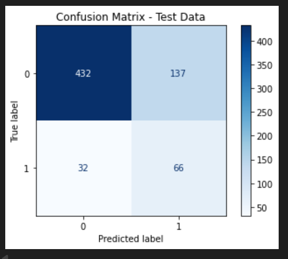
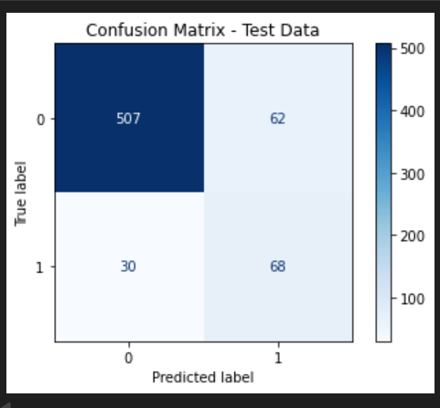
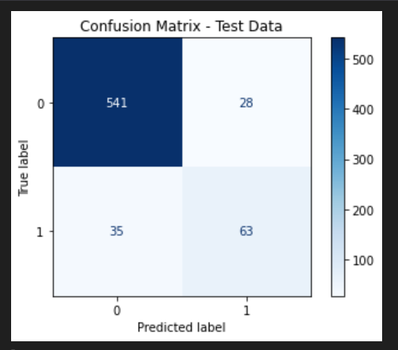
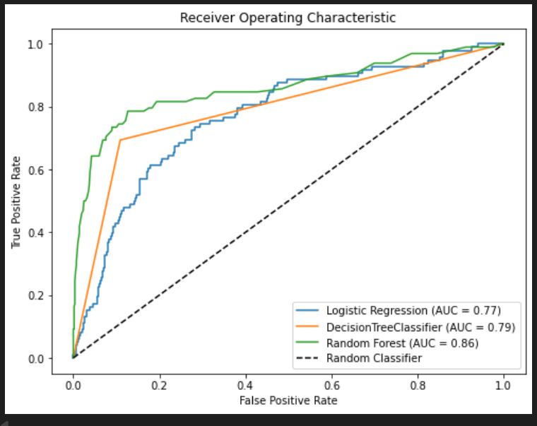
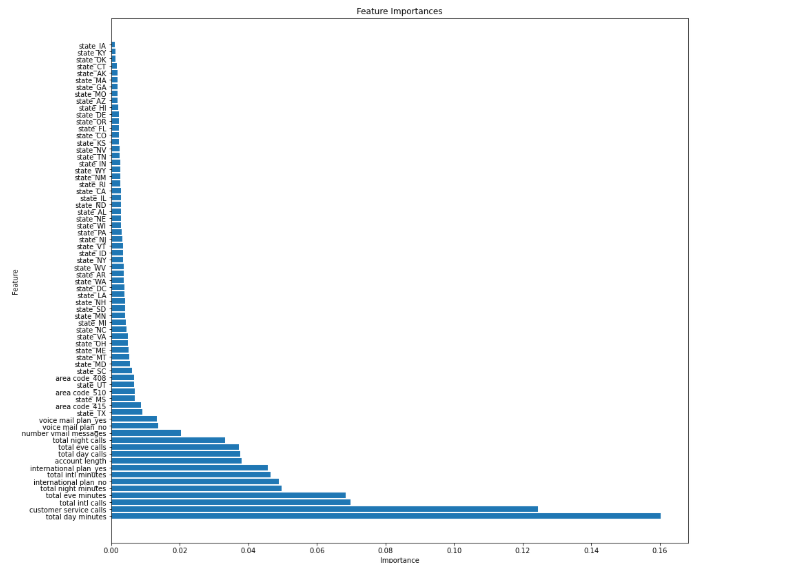

# SYRIA TEL CHURN ANALYSIS

## OVERVIEW
SyriaTel is a telecommunications company that provides mobile and data services to thousands of customers. Like many telecom providers, SyriaTel faces a recurring challenge: customer churn — when customers stop using the company's services and switch to a competitor.
Churn results in significant losses because acquiring new customers is far more expensive than retaining existing ones. This project aims to use machine learning classification models to help SyriaTel identify customers who are at high risk of leaving.

## BUSINESS UNDERSTANDING
### Problem Statement
SyriaTel currently does not have an effective system for predicting churn early enough to intervene. Many customers who leave show warning signs — such as increased customer service calls or specific plan choices — but these signals are not consistently tracked or analyzed.

Because of this:
* SyriaTel loses revenue when valuable customers leave.
* The marketing team cannot target retention campaigns effectively.
* Customer service cannot focus on high-risk customers who need support.
* The company lacks data-driven insight into the main reasons behind churn.

### Key Objectives
* Build a classification model to predict customer churn.
* Evaluate model performance using metrics like AUC, recall, and F1-score.
* Identify key factors that contribute to churn.
* Provide actionable recommendations for reducing customer churn.
* Support SyriaTel in improving retention and reducing revenue loss.

## DATA OVERVIEW
This [dataset](https://www.kaggle.com/datasets/becksddf/churn-in-telecoms-dataset) contains customer-level information from SyriaTel, where each row represents an individual customer and their interaction with the company’s services. The data includes call usage patterns across different time periods (day, evening, night, and international), customer service interactions, subscription plans, and a churn indicator showing whether a customer left the service. The dataset is used to understand customer behavior, identify factors that contribute to churn, and support the development of predictive models aimed at improving customer retention and reducing revenue loss.

## DATA PREPARATION
| Step | Description | Why It’s Done |
|------|-------------|----------------|
| **1. Split Features and Target** | Separate the input features (X) from the target variable (y = churn). | Models train on X and learn to predict y, so the two must be separated. |
| **2. One-Hot Encoding** | Convert categorical columns into 0/1 binary columns using `OneHotEncoder`. | ML models require numerical inputs; encoding prevents misinterpreting categories as numeric values. |
| **3. Scaling Numerical Features** | Transform numerical columns to a 0–1 range using `MinMaxScaler`. | Prevents large-valued features from dominating small-valued ones; improves model stability. |
| **4. Combine Encoded + Scaled Features** | Merge all processed columns into a final cleaned dataset. | Ensures the model receives fully numeric and standardized input. |
| **5. Train–Test Split** | Split data into training (80%) and testing (20%). | Training evaluates model learning while testing checks real-world performance. |
| **6. Check Class Imbalance** | Count the number of churn vs. non-churn samples. | Imbalance causes the model to favor the majority class. |
| **7. Apply SMOTE (Oversampling)** | Generate synthetic samples for the minority class in the training data only. | Balances the classes so the model learns churn patterns better and avoids bias. |
| **8. Final Training Data** | Balanced `X_train` and `y_train` with equal class counts. | Ensures fair model training and improved predictive power. |

## MODELING 
### 1.Logistics Regression Model
The model demonstrated strong learning performance on the training data, achieving balanced precision, recall, and F1-score of approximately 0.77. When evaluated on unseen test data, recall remains relatively high at 0.67, indicating the model’s ability to identify customers at risk of churning. However, precision drops to 0.33, suggesting an increase in false positive churn predictions. This trade-off reflects a recall-focused model that prioritizes identifying potential churners over minimizing false alarms, which may be suitable depending on the cost of customer retention strategies.

The confusion matrix shows that the model performs well at identifying non-churners, correctly classifying most of them (432 true negatives), but it struggles with precision when predicting churners. Although it successfully detects a good proportion of actual churners (66 true positives, about 67% recall), it also incorrectly labels many non-churners as churners (137 false positives), which lowers precision. Overall, the model prioritizes catching churners rather than being very accurate about who will churn, making it useful for retention strategies where missing a churner is more costly than contacting a customer who would not churn.

### 2. Decision Tree Model
 The Decision Tree model demonstrated strong predictive performance, achieving high accuracy and substantially improved churn detection compared to previous models. It correctly identifies most non-churners and captures approximately 69% of actual churners, making it effective for customer retention efforts. However, the model exhibits signs of overfitting, as evidenced by perfect training scores, suggesting that pruning or limiting tree depth would be necessary to improve generalization to unseen data.
 

 This confusion matrix shows that the model performs very well at identifying non-churners, correctly classifying 507 customers who did not churn, with relatively few false alarms (62 false positives). It also identifies a good proportion of actual churners, correctly predicting 68 churn cases, while missing 30 churners. Overall, the model achieves a strong balance between catching customers at risk of churning and minimizing unnecessary churn predictions, making it more reliable and cost-effective for churn prediction than the earlier model.

 ### 3.Random Forest Model
 The Random Forest model demonstrated strong and well-balanced performance, achieving a high test accuracy of 91%. It effectively identifies non-churners while also improving churn detection, correctly capturing 64% of actual churners with a precision of 69%. Although the model fits the training data perfectly, its strong test results indicate good generalization and reduced overfitting compared to simpler tree-based models. Overall, this model provides the most reliable and business-useful churn predictions among the models evaluated.

This confusion matrix shows that the model performs very strongly overall, especially in identifying non-churners. It correctly classifies 541 non-churn customers with very few false positives (28), indicating high precision for the non-churn class. The model also identifies a good number of churners (63 true positives), though it still misses some (35 false negatives). Overall, the model achieves a strong balance between minimizing false alarms and correctly detecting customers at risk of churning, making it well-suited for churn prediction tasks.

## MODELS EVALUATION

The ROC curve shows that the Random Forest model performs best, with the highest AUC (0.86), indicating the strongest ability to distinguish between churners and non-churners. The Decision Tree performs moderately well (AUC = 0.79), while Logistic Regression has the lowest performance (AUC = 0.77). Overall, Random Forest is the most reliable model among the three.
 
 ### Performing Hyperparameter tuning
 * GridSearchCV was used to tune the Random Forest model by testing 16 parameter combinations with 5-fold cross-validation (80 total fits).
 * The best model selected uses 100 trees with no depth restriction and minimal split constraints.
 After tuning, the model achieved 91% test accuracy with improved churn detection (63% recall, 70% precision for churners).
 * Although the model fits the training data perfectly, its strong test performance indicates good generalization.
 * The tuned Random Forest provides the best balance between accuracy and churn prediction, making it suitable for deployment.

 ### Feature Importants
 

 Based on the feature importance analysis from the Random Forest model, the following variables were identified as the most influential in predicting customer churn:
* Total Day Minutes
Customers with high daytime call usage are more engaged with the service and therefore more sensitive to pricing, call quality, and service disruptions. Any dissatisfaction experienced during peak usage hours increases the likelihood of churn.
* Customer Service Calls
A high number of customer service calls is a strong indicator of dissatisfaction. Frequent interactions with support often signal unresolved issues, poor service experience, or billing concerns, which significantly increase churn risk.
* Total International Calls
Customers making many international calls are more likely to churn due to higher costs and sensitivity to international pricing. If international plans are perceived as expensive or inflexible, these customers may seek alternative providers.
* Total Evening Minutes
High evening usage suggests customers rely heavily on the service during off-work hours. Service quality issues or cost concerns during these periods can strongly influence their decision to leave.
* Total Night Minutes
Customers with high night-time usage may be price-sensitive and attracted to competitors offering cheaper night call rates or better bundled plans, increasing churn risk.
 
 ## CONCLUSION
 This project successfully developed a classification model to predict customer churn for SyriaTel and evaluated multiple models using accuracy, recall, F1-score, and ROC–AUC. The Random Forest model emerged as the best-performing model, demonstrating strong predictive power and good generalization. Feature importance analysis revealed that customer churn is largely driven by usage intensity and service experience, particularly total day, evening, and night minutes, the number of customer service calls, and international call activity. These findings indicate that highly active customers and those frequently interacting with customer support are more sensitive to pricing, service quality, and unresolved issues, making them more likely to churn.

## RECOMMENDATIONS
* Improve Customer Service Resolution: Prioritize resolving customer issues on the first interaction, especially for customers with frequent service calls, as repeated contact is a strong churn indicator.

* Target High-Usage Customers: Monitor customers with high day, evening, and night call minutes and proactively offer loyalty incentives, improved service quality, or personalized plans to reduce churn risk.

* Review International Call Pricing: Reassess international call rates and consider bundled or discounted international plans to retain customers with high international call usage.

* Proactive Retention Strategies: Use the churn model to identify high-risk customers early and engage them with targeted retention campaigns before they decide to leave.

* Continuous Model Monitoring: Regularly retrain and evaluate the model using new data to ensure it remains accurate as customer behavior and market conditions change.